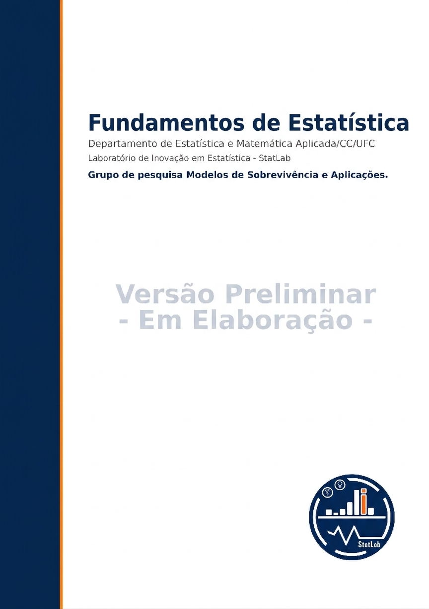

::: {.content-visible when-format="html"}
{fig-align="center" width="100%"}
:::

# Informações Legais e Declaração de Uso de Inteligência Artificial {.unnumbered}

## Direitos Autorais e Uso da Obra {.unnumbered}

© 2026 --- Os autores.

Todos os direitos reservados. Esta obra é protegida pela legislação brasileira de direitos autorais (Lei nº 9.610/1998). É vedada a reprodução, distribuição, armazenamento ou transmissão total ou parcial deste livro, por qualquer meio ou processo, eletrônico ou mecânico, sem autorização expressa e por escrito dos autores, salvo nos casos permitidos pela legislação vigente para fins exclusivamente acadêmicos e não comerciais, com a devida citação da fonte.

A utilização do material em ambientes de ensino é permitida desde que preservada a integridade do conteúdo, mencionada a autoria e respeitados os princípios de uso responsável da informação científica. A reprodução para fins comerciais, bem como a modificação substancial do conteúdo sem autorização, constitui violação de direitos autorais.

## Declaração sobre o Uso de Ferramentas de Inteligência Artificial {.unnumbered}

Durante a elaboração deste livro foram utilizadas ferramentas de Inteligência Artificial, em especial sistemas de apoio à escrita e organização textual, como recurso complementar no processo de produção acadêmica.

O uso de IA teve caráter **estritamente assistivo**, não substituindo o desenvolvimento conceitual, a formulação matemática, a interpretação estatística nem as decisões pedagógicas da obra. Todo conteúdo foi cuidadosamente revisado, validado e adaptado pelos autores, que assumem integral responsabilidade científica e intelectual pelo texto final.

Não foram delegadas à IA decisões metodológicas, inferenciais ou conclusões analíticas. A elaboração teórica, a seleção de exemplos, a validação matemática e a coerência didática resultam da experiência acadêmica e da atuação dos autores na área de Modelos de Regressão.

Reafirmamos que o uso responsável de tecnologias emergentes deve sempre preservar o rigor científico, a integridade acadêmica e o protagonismo intelectual humano.

# Prefácio {.unnumbered}

Este livro resulta da experiência acumulada no ensino, na orientação de estudantes e no desenvolvimento de pesquisas em modelos de regressão. Somos docentes pesquisadores do Departamento de Estatística e Matemática Aplicada da Universidade Federal do Ceará (DEMA/UFC), com atuação contínua em regressão linear, modelagem estatística e inferência. Integramos o Laboratório de Inovação em Estatística — StatLab/UFC (<https://statlab.quarto.pub/>) e o Grupo de Pesquisa *Modelos de Sobrevivência e Aplicações* do CNPq (<http://dgp.cnpq.br/dgp/espelhogrupo/9639095385610769>), espaços nos quais articulamos ensino, pesquisa e aplicação a problemas reais.

O material tem como base as disciplinas Fundamentos de Estatística e Estatística Aplicadas às Ciências Sociais. Ao longo dos anos, consolidamos a convicção de que ensinar regressão exige equilíbrio entre rigor teórico e clareza interpretativa.

O livro desenvolve os conceitos de introdutórios de Estatística de forma progressiva, enfatizando interpretação e propriedades. A implementação é realizada integralmente no **R**, utilizado como ambiente de experimentação conceitual e não apenas como ferramenta computacional.

Os fundamentos matemáticos mais densos são apresentados em apêndices específicos, preservando o fluxo didático do texto principal e permitindo diferentes níveis de aprofundamento. Acreditamos que os conceitos iniciais de Estatística devam ser ensinados com atenção às suas suposições, limitações e implicações práticas.

Esperamos que este livro contribua para a formação de profissionais capazes tomar decisões com rigor técnico, pensamento estatístico crítico e responsabilidade analítica.