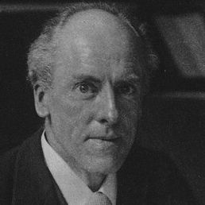
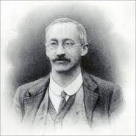
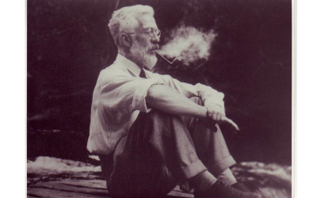
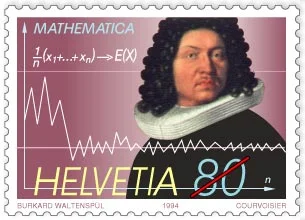
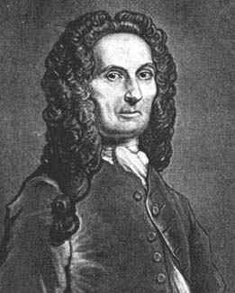
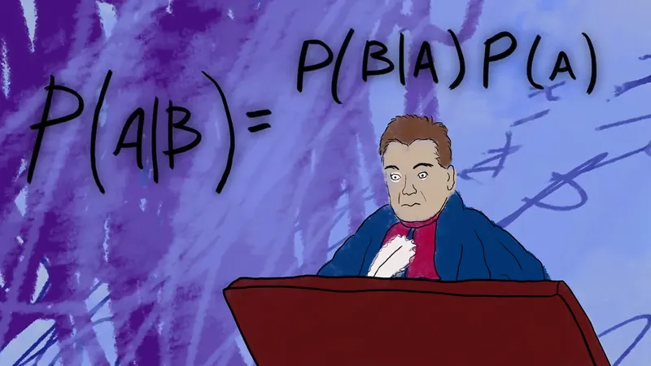
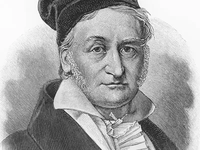
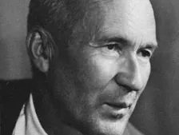

# Introdução

A origem da palavra **Estatística** está associada à palavra latina STATUS (Estado). Há indícios de que 3000 anos A.C. já se faziam *censos na Babilônia*, China e Egito e até mesmo o 4º livro do *Velho Testamento* faz referência à uma instrução dada a Moisés, para que fizesse um levantamento dos homens de Israel que estivessem aptos para guerrear. Usualmente, estas informações eram utilizadas para a *taxação de impostos* ou para o *alistamento militar*. O Imperador *César Augusto*, por exemplo, ordenou que se fizesse o Censo de todo o Império Romano.

A palavra **CENSO** é derivada da palavra *CENSERE*, que em Latim significa *TAXAR*. Em 1085, *Guilherme, O Conquistador*, solicitou um levantamento estatístico da Inglaterra, que deveria conter informações sobre terras, proprietários, uso da terra, empregados e animais. Os resultados deste censo foram publicados em 1086 no livro intitulado *“Domesday Book”* e serviram de base para o *cálculo de impostos*.


Contudo, mesmo que a prática de coletar dados sobre colheitas, composição da população humana ou de animais, impostos, etc., fosse conhecida pelos egípcios, hebreus, caldeus e gregos, e se atribuam a Aristóteles cento e oitenta descrições de Estados, apenas no *século XVII* a Estatística passou a ser considerada *disciplina autônoma*, tendo como objetivo básico a *descrição dos BENS do Estado*. 


A palavra **Estatística** foi cunhada pelo acadêmico alemão *Gottfried Achenwall* (1719-1772), que foi um notável continuador dos estudos de *Hermann Conrig* (1606-1681). A escola alemã atingiu sua maturidade com *A. L. Von Schlozer* (1735-1809), mas sempre com ideias diferentes daquelas que fundamentaram a Estatística Moderna. Com algum exagero, pode-se dizer que o seu principal legado foi o termo *STAATENKUNDE*, que deu origem à designação atual. Na Enciclopédia Britânica, o verbete *STATISTICS* apareceu em 1797.


Em contraposição à natureza eminentemente qualitativa da escola alemã, na Inglaterra do século XVII surgiram os aritméticos políticos, dentre os quais se destacaram *John Graunt* (1620-1674) e *William Petty* (1623-1687). Eles preocuparam-se com o estudo numérico dos fenômenos sociais e políticos, na busca de leis quantitativas que pudessem explicá-los. O estudo consistia essencialmente de exaustivas análises de nascimentos e mortes, realizadas através das *Tábuas de Mortalidade*, que deram origem às atuais tábuas usadas pelas companhias de seguros. Dessa forma, a escola dos aritméticos políticos pode ser considerada o berço da *Demografia*. Um de seus mais notáveis adeptos foi o pastor alemão *Sussmilch* (1707-1767), com o qual pode-se dizer que a Estatística
aparece pela primeira vez como meio indutivo de investigação.


Na última metade do século XIX, os alemães *Helmert* (1843-1917) e *Wilhelm Lexis* (1837-1914), o dinamarquês *Thorvald Nicolai Thiele* (1838-1910) e o inglês *Francis Ysidro Edgeworth* (1845-1926), obtiveram resultados extremamente valiosos para o desenvolvimento da Inferência
Estatística, muitos dos quais só foram completamente compreendidos mais tarde. Contudo, o impulso decisivo deve-se a *Karl Pearson* (1857-1936), *William S. Gosset* (1876-1937) e, em especial, a *Ronald A. Fisher* (1890-1962).


## Figuras ilustres na área de Estatística

::: {.columns}
::: {.column width="30%"}

```{r}
#| label: fig-pearson
#| echo: false
#| message: false
#| warning: false
#| layout-ncol: 1
#| fig-cap: "Karl Pearson"


```

:::

::: {.column width="65%"}
[Karl Pearson](https://www.britannica.com/biography/Karl-Pearson) (1857-1936) formou-se em 1879 pela Cambridge University e inicialmente dedicou-se ao estudo da evolução de Darwin, aplicando os métodos estatísticos aos problemas biológicos relacionados com a evolução e hereditariedade. Em 1896, Pearson foi eleito membro da Royal Society of London. Entre 1893 e 1912 escreveu um conjunto de 18 artigos denominado Mathematical Contribution to the Theory Evolution, com contribuições extremamente importantes para o desenvolvimento da teoria da Análise de Regressão e do Coeficiente de Correlação, bem como do Teste de Hipóteses de Qui-quadrado. Em sua maioria, seus trabalhos foram publicados na revista Biometrika, que fundou em parceria com **Walter Frank Raphael Weldon** (1860-1906) e **Francis Galton** (1822-1911). Além da valiosa contribuição que deu para a teoria da regressão e da correlação, Pearson fez com que a Estatística fosse reconhecida como uma disciplina autônoma. Uma coleção de seus artigos foi publicada em *"Karl Pearson Early Statistical Papers" (Ed. por E. S. Pearson, Cambridge University Press, 1948)*.
:::
:::

::: {.columns}
::: {.column width="30%"}

```{r}
#| label: fig-gosset
#| echo: false
#| message: false
#| warning: false
#| layout-ncol: 1
#| fig-cap: "William Sealey Gosset"


```

:::

::: {.column width="65%"}
[William Sealey Gosset](https://rss.onlinelibrary.wiley.com/doi/10.1111/j.1740-9713.2008.00279.x) (1876-1937) estudou Química e Matemática na *New College Oxford*. Em 1899 foi contratado como Químico da Cervejaria Guiness em Dublin, desenvolvendo um trabalho extremamente importante na área de Estatística. Devido à necessidade de manipular dados provenientes de pequenas amostras, extraídas para melhorar a qualidade da cerveja, Gosset derivou o teste t de Student baseado na distribuição de probabilidades. Esses resultados foram publicados em 1908 na revista *Biometrika*, sob o pseudônimo de Student, dando origem a uma nova e importante fase dos estudos estatísticos. **Gosset** usava o pseudônimo de **Student**, pois a Cervejaria Guiness não desejava revelar aos concorrentes os métodos estatísticos que estava empregando no controle de qualidade da cerveja. Os estudos de **Gosset** podem ser encontrados em *"Student Collected Papers" (Ed. por E.S.Pearson e J. Wishart, University College, Londres, 1942)*.
:::
:::

::: {.columns}
::: {.column width="30%"}

```{r}
#| label: fig-fisher
#| echo: false
#| message: false
#| warning: false
#| layout-ncol: 1
#| fig-cap: "Ronald Aylmer Fisher"


```

:::

::: {.column width="65%"}
A contribuição de [Ronald Aylmer Fisher](https://www.ucl.ac.uk/biosciences/gee/ucl-centre-computational-biology/ronald-aylmer-fisher-1890-1962) (1890-1962) para a Estatística Moderna é, sem dúvidas, a mais importante e decisiva de todas. Formado em astronomia pela Universidade de Cambridge em 1912, foi o fundador do célebre Statistical Laboratory da prestigiosa Estação Agronômica de Rothamsted, contribuindo enormemente tanto para o desenvolvimento da Estatística quanto da Genética. Ele apresentou os princípios de Planejamento de Experimentos, introduzindo os conceitos de Aleatorização e da Análise da Variância, procedimentos muito usados atualmente.

No princípio dos **anos 20**, estabeleceu o que a maioria aceita como a estrutura da moderna Estatística Analítica, através do conceito da verossimilhança (likelihood). O seu livro intitulado "Statistical Methods for Research Workers", publicado pela primeira vez em 1925, foi extremamente importante para familiarizar os investigadores com as aplicações práticas dos métodos estatísticos e, também, para criar a mentalidade estatística entre a nova geração de cientistas.

Os trabalhos de **Fisher** encontram-se dispersos em numerosas revistas, mas suas contribuições mais importantes foram reunidas em *"Contributions to Mathematical Statistics" (J. Wiley & Sons, Inc.,Nova Iorque, 1950)*.
Fisher foi eleito membro da *Royal Society* em 1929 e condecorado com as medalhas *Royal Medal of the Society* em 1938 e *Darwin Medal of the Society* em 1948. Em 1955 foi novamente condecorado, desta vez com a medalha *Copley Medal of the Royal Society*.
:::
:::

::: {.columns}
::: {.column width="30%"}

```{r}
#| label: fig-bernoulli
#| echo: false
#| message: false
#| warning: false
#| layout-ncol: 1
#| fig-cap: "Jakob Bernoulli"


```

:::

::: {.column width="65%"}
[Jakob Bernoulli](https://www.britannica.com/biography/Jakob-Bernoulli) (1654-1705), estimulado por *Gottfried Wilhelm von Leibniz* (1646-1716) também dedicou-se ao estudo do Cálculo de Probabilidades, cuja grande obra denominada *“Ars Conjectandi”* foi publicada oito anos após a sua morte. Em *Ars Conjectandi* de **Jacques Bernoulli**, foi rigorosamente provada a Lei dos Grandes Números de Bernoulli, considerada o primeiro teorema limite. Pode-se dizer que graças às contribuições de **Bernoulli** o Cálculo de Probabilidades adquiriu o status de ciência. Além da obra póstuma de **Bernoulli**, o início do século XVII foi marcado pelos livros de *Pierre Rémond de Montmort* (1678-1719), denominado *“Essai d'Analyse sur les Jeux de Hazard”*, e de *Abraham De Moivre* (1667-1754), intitulado *“The Doctrine of Chances”*.
:::
:::


::: {.columns}
::: {.column width="30%"}

```{r}
#| label: fig-moivre
#| echo: false
#| message: false
#| warning: false
#| layout-ncol: 1
#| fig-cap: "Abraham de Moivre"


```

:::

::: {.column width="65%"}
[Abraham de Moivre](https://www.britannica.com/biography/Abraham-de-Moivre) era Francês de nascimento, mas desde a sua infância refugiou-se na Inglaterra devido às guerras religiosas, fazendo aplicações ao cálculo de anuidades e estabelecendo uma equação simples para a lei da mortalidade entre 22 anos e o limite da longevidade que fixou em 86 anos. Mais tarde, na *"Miscellanea Analytica"*, apresentou resultados aos quais **Laplace** deu uma forma mais geral e que constituem o *segundo teorema limite*. Em 1738, com a segunda edição da *Doutrina das Chances (The Doctrine of Chances)*, publica formalmente a Distribuição Normal, desenvolvida desde 1933.
:::
:::

::: {.columns}
::: {.column width="30%"}

```{r}
#| label: fig-bayes
#| echo: false
#| message: false
#| warning: false
#| layout-ncol: 1
#| fig-cap: "Thomas Bayes"


```

:::

::: {.column width="65%"}
É extremamente importante falar, também, do reverendo [Thomas Bayes](https://www.britannica.com/topic/Nonconformist) (1702-1761) a quem se deve o conceito de probabilidade inversa, relacionado com situações em que se caminha do particular para o geral. No seu livro denominado *"Essay towards solving a problem of the doctrine of chances" (Philosophical Transactions of the Royal Society of London, 1764-65, póstumo)*, **Bayes** formula através do teorema que leva seu nome e do postulado que tantas vezes se lhe associa: a primeira tentativa de matematização da inferência Estatística. Mesmo sem ter publicado
nenhum trabalho com seu nome, em 1742 **Thomas Bayes** foi eleito membro da *Royal Society of London*.
:::
:::

::: {.columns}
::: {.column width="30%"}

```{r}
#| label: fig-gauss
#| echo: false
#| message: false
#| warning: false
#| layout-ncol: 1
#| fig-cap: "Johann Carl Friedrich Gauss"


```

:::

::: {.column width="65%"}
Os estudos dos astrônomos Pierre-Simon Laplace (1749-1827), [Johann Carl Friedrich Gauss](https://www.britannica.com/biography/Carl-Friedrich-Gauss) (1777-1855) e *Lambert Adolphe Jacques Quetelet* (1796-1874) foram fundamentais para o desenvolvimento do Cálculo de Probabilidades. Devido aos novos métodos e idéias, o trabalho de *Laplace* de 1812, intitulado *“Théorie Analytique des Probabilités”*, até o presente é considerado um dos mais importantes trabalhos sobre a matéria. **Johann Carl Friedrich Gauss**, professor de astronomia e diretor do Observatório de Gottingen, em 1809 apresentou o estudo intitulado *“Theoria combinationis Observatorium Erroribus Minimis Obnoxia”*, explanando uma teoria sobre a análise de observações aplicável a qualquer ramo da ciência, alargando o campo de aplicação do Cálculo de Probabilidades. Com *Lambert Adolphe Jacques Quetelet*, por sua vez, inicia-se a aplicação aos fenômenos sociais. O seu escrito *“Sur l'homme et le développement de ses facultes”* foi publicado em segunda
edição com o título *“Physique sociale”* ou *“Essai sur le développement des facultés de l'homme”*, que incluía pormenorizada análise da teoria da probabilidade.
*Quetelet* introduziu também o conceito de “homem médio” e chamou particular atenção para a notável consistência dos fenômenos sociais. Por exemplo, mostrou que fatores como a criminalidade apresentam permanências em relação a diferentes países e classes sociais.
:::
:::


::: {.columns}
::: {.column width="30%"}

```{r}
#| label: fig-kolmogorov
#| echo: false
#| message: false
#| warning: false
#| layout-ncol: 1
#| fig-cap: "Andrey Nikolayevich Kolmogorov"


```

:::

::: {.column width="65%"}
Na segunda metade do século XIX a Teoria das Probabilidades atingiu um dos pontos mais altos com os trabalhos da escola russa fundada por *Pafnuty Lvovich Chebyshev* (1821-1894), que
contou com representantes como *Andrei Andreyevich Markov* (1856-1922) e *Aleksandr Mikhailovich Lyapunov* (1857-1918). Contudo, o seu maior expoente foi [Andrey Nikolayevich Kolmogorov](https://www.britannica.com/biography/Andrey-Nikolayevich-Kolmogorov) (1903-1987), a quem se deve
um estudo indispensável sobre os fundamentos da Teoria das Probabilidades (os axiomas de Kolmogorov), denominado *“Grundbegrife der Warscheinlichkeitrechnung”*, publicado em 1933. Em 1950 foi traduzido para o Inglês sob o título *“Foundations of Probability”*.
:::
:::

## Atividade

1. Foram destacados apenas contribuições masculinas para a área da Estatística. Pesquise sobre mulheres que foram importantes para o desenvolvimento desta área.

